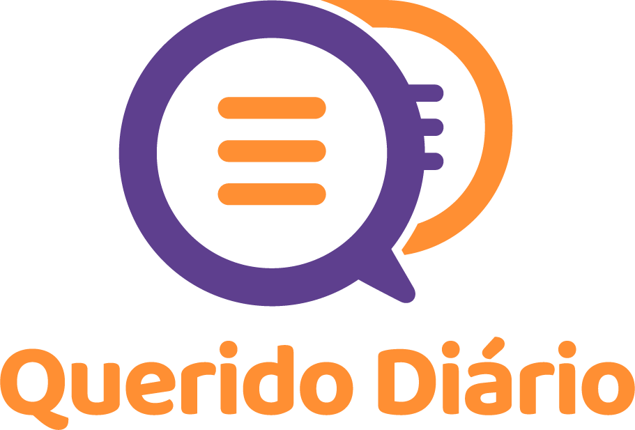

[](https://pypi.org/project/querido-diario-toolbox/)
[](https://pypi.org/project/querido-diario-toolbox/)

**Português (BR)** | [English (US)](.github/README-en-US.md) 

<p align="center">
  <a href="https://queridodiario.ok.org.br/sobre" target="_blank"> 
  </a>
</p>


# Toolbox
Dentro do [ecossistema do Querido Diário](https://github.com/okfn-brasil/querido-diario-comunidade/blob/main/.github/CONTRIBUTING.md#ecossistema), este repositório oferece uma **biblioteca** com o ferramental para que a comunidade possa fazer suas próprias análises e manipulações com os recursos do projeto.

Conheça mais sobre as [tecnologias](https://queridodiario.ok.org.br/tecnologia) e a [história](https://queridodiario.ok.org.br/sobre) do projeto no [site do Querido Diário](https://queridodiario.ok.org.br)


# Sumário
- [Como contribuir](#como-contribuir)
- [Como configurar o ambiente de desenvolvimento](#como-configurar-o-ambiente-de-desenvolvimento)
- [Exemplos de uso](#exemplos-de-uso)
   - [Removendo espaços desnecessários em um texto](#removendo-espaços-desnecessários-em-um-texto)
   - [Encontrando CNPJs válidos em um texto](#encontrando-cnpjs-válidos-em-um-texto)
   - [Convertendo arquivo de formato fechado para texto puro e extraindo metadados](#convertendo-arquivo-de-formato-fechado-para-texto-puro-e-extraindo-metadados)
- [Suporte](#suporte)
- [Agradecimentos](#agradecimentos)
- [Open Knowledge Brasil](#open-knowledge-brasil)
- [Licença](#licença)


# Como contribuir
<p>  
  <a href="https://www.catarse.me/queridodiario-okbr" target="_blank"> 
    
  </a>
</p> 

Agradecemos por considerar contribuir com o Querido Diário! :tada:

Você encontra como fazê-lo no [CONTRIBUTING.md](.github/CONTRIBUTING.md)!

# Como configurar o ambiente de desenvolvimento

Para utilizar a `querido-diario-toolbox` é necessário ter [Python](https://docs.python.org/3.8/) (3.8+) instalado, além de [Tesseract OCR](https://tesseract-ocr.github.io/tessdoc/), os `.jar` de [Apache Tika](https://tika.apache.org/download.html) (v1.24.1+) e [Tabula](https://github.com/tabulapdf/tabula-java/releases) (v1.0.4+). 


1. Para instalar a biblioteca `querido-diario-toolbox` basta abrir um terminal e executar o seguinte comando: 
```console
$ pip install querido-diario-toolbox
```

# Exemplos de uso

Exemplos mais elaborados estão disponíveis na pasta
[`./examples`](examples). Você pode visualizá-los (e interagir se desejar)
utilizando notebooks [Jupyter](https://jupyter.org/).

## Removendo espaços desnecessários em um texto

```python
In [1]: from querido_diario_toolbox.process.text_process import remove_breaks

In [2]: texto = "\n\n\nEste texto tem vários      espaços em branco\n\n \ndesnecessários.\n"

In [3]: remove_breaks(texto)
Out[3]: 'Este texto tem vários espaços em branco desnecessários.'
```

## Encontrando CNPJs válidos em um texto

```python
In [1]: from querido_diario_toolbox.process.edition_process import extract_and_validate_cnpj

In [2]: texto = "As empresas de CNPJ válidos 00.000.000/0001-91 e 00.360.305/0001-04 existem mas a de CNPJ 12.123.123/1234.12 não existe..."

In [3]: extract_and_validate_cnpj(texto)
Out[3]: ['00.000.000/0001-91', '00.360.305/0001-04']
```

## Convertendo arquivo de formato fechado para texto puro e extraindo metadados

```python
In [1]: from querido_diario_toolbox import Gazette
   ...: from querido_diario_toolbox.etl.text_extractor import create_text_extractor

In [2]: config = {"apache_tika_jar": "caminho/apache/tika/jar/tika-app-1.24.1.jar"}
   ...: extrator = create_text_extractor(config)

In [3]: diario = Gazette(filepath="caminho/diario/fechado/diario.pdf")

In [4]: extrator.extract_text(diario)
   ...: extrator.extract_metadata(diario)
   ...: extrator.load_content(diario)
```

Após a execução de `extrator.load_content(diario)`, dois arquivos (um `.txt`
com o texto puro e um `.json` com os metadados) serão criados.

# Suporte 
<p>  
  <a href="https://discord.com/invite/mxHGPq8rdY" target="_blank">
    
  </a>
</p>

Ingresse em nosso [Discord](https://discord.com/invite/mxHGPq8rdY) para trocas sobre os projetos, dúvidas, pedidos de ajuda com contribuição e conversar sobre inovação cívica em geral.


# Agradecimentos
Este projeto é mantido pela Open Knowledge Brasil e possível graças à comunidade técnica, às [Embaixadoras de Inovação Cívica](https://embaixadoras.ok.org.br/), às pessoas voluntárias e doadoras financeiras, além de universidades parceiras, empresas apoiadoras e financiadoras.

Conheça [quem apoia o Querido Diário](https://queridodiario.ok.org.br/apoie#quem-apoia).


# Open Knowledge Brasil
<p>
  <a href="https://twitter.com/okfnbr" target="_blank">
    
  </a>
  <a href="https://www.instagram.com/openknowledgebrasil/" target="_blank">
    
  </a>
  <a href="https://www.linkedin.com/company/open-knowledge-brasil" target="_blank">
    
  </a>
  <a href="https://www.facebook.com/OpenKnowledgeBrasil" target="_blank">
    
  </a>
</p>

A [Open Knowledge Brasil](https://ok.org.br/) é uma organização da sociedade civil sem fins lucrativos, cuja missão é utilizar e desenvolver ferramentas cívicas, projetos, análises de políticas públicas, jornalismo de dados para promover o conhecimento livre nos diversos campos da sociedade. 

Todo o trabalho produzido pela OKBR está disponível livremente.


# Licença

Código licenciado sob a [Licença MIT](LICENSE.md).